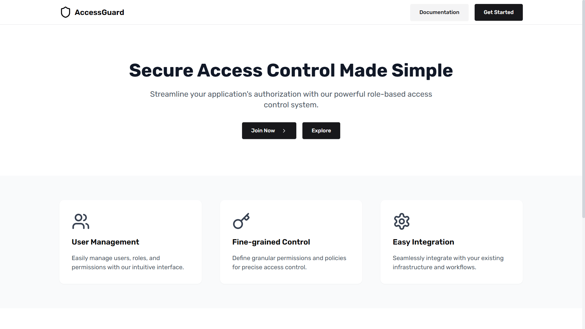
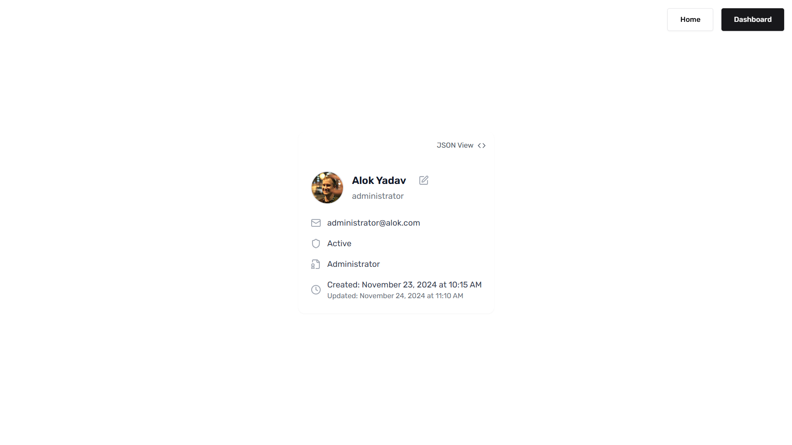
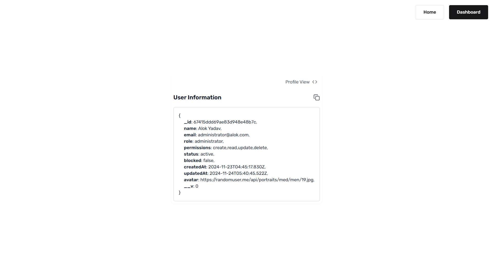
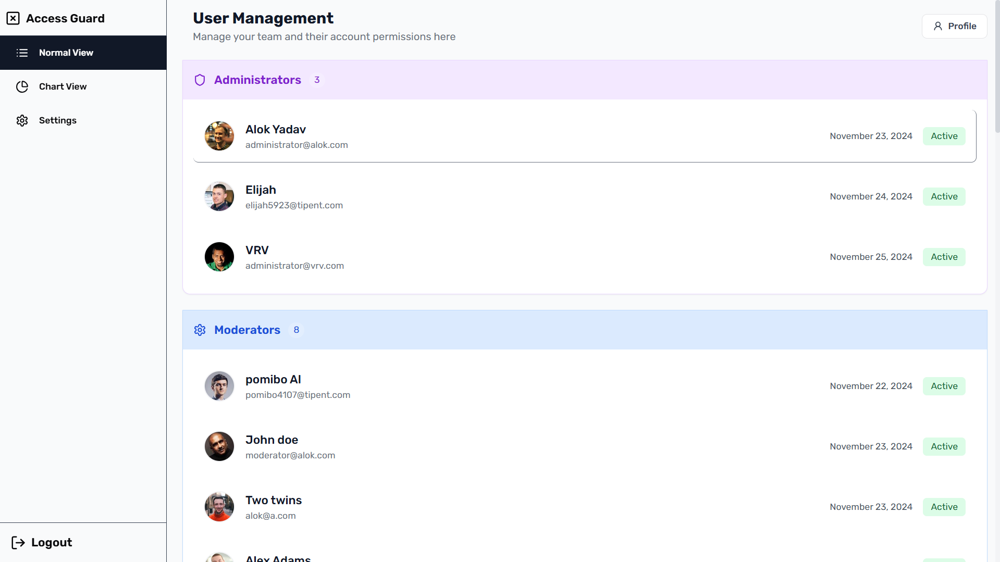
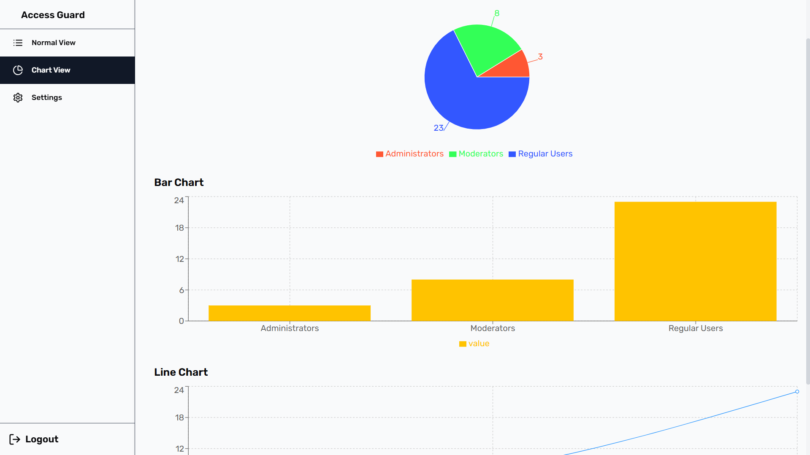
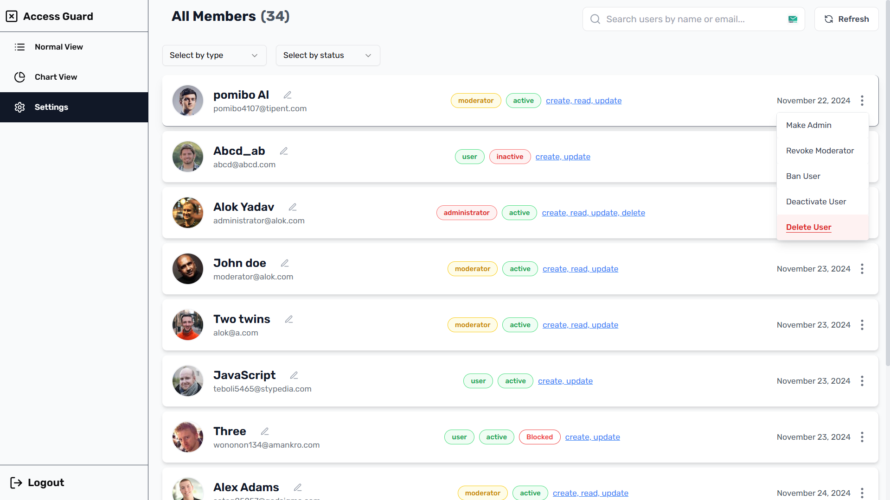

# Role Based Access Control | RBAC

A React-based RBAC system for managing user roles and permissions. This project implements a secure and intuitive interface for handling access control, user management, and permissions based on roles.

[Live Demo](https://rbac-alok.vercel.app)

```js
For Administrator

Email: administrator@vrv.com
Password: VRV12345

For Moderator

Email: moderator@vrv.com
Password: VRV12345

For User

Email: user@vrv.com
Password: VRV12345
```

## Features

### Role Management

-   **User Role**: Can log in and access only user-specific pages. Restricted from accessing admin or moderator pages.
-   **Moderator Role**: Can access both user and moderator pages but restricted from admin-specific pages.
-   **Administrator Role**: Full access to all pages and functionalities.

### Views

-   **Normal View**: Displays user-related information in a standard format like a list.
-   **Chart View**: Visualizes data in chart formats.
-   **Settings View**: A comprehensive dashboard for managing users according to role, permission, and active status.

### User Management

-   **Search, Filter, and Pagination**: Easily find and manage users with advanced filtering and pagination.
-   **Multiple Actions (Admin and Moderator)**:
    -   Assign roles and permissions.
    -   Ban or delete users.
    -   Edit user details such as name.
    -   Toggle active status.

### Profile Page

-   Two Views:
    -   **Normal View**: Displays user information in a formatted manner.
    -   **JSON View**: Displays raw user data in JSON format for debugging or advanced use cases.

### Routes

1. **Authentication Check**: Redirects logged-in users visiting the registration page to the profile page.
2. **Permission-Based Check**: Ensures users have the necessary permissions before accessing protected routes like the admin dashboard.

### Contexts

-   **Sidebar Context**: Manages the sidebar's state for better UI interaction.
-   **User Data Context**: Fetches user data on initialization and sets it in context for global availability.

## Live Preview

1. Home page

    

2. Profile page

    (Normal View)
    

    (JSON View)
    

3. Admin Dashboard

    (Normal View)
    

    (Chart View)
    

    (Settings View)
    

## Installation

1. **Clone the Repository**

    ```bash
    git clone https://github.com/alok/rbac_vrv.git
    cd rbac_vrv
    ```

2. **Install Dependencies**

    ```bash
    npm install
    ```

3. **Start the Application**
    ```bash
    npm run dev
    ```

## Usage

1. **Login**: Log in using valid credentials as a user, moderator, or administrator.
2. **Navigation**:
    - Users see only user-specific pages.
    - Moderators see both user and moderator pages.
    - Administrators see all available pages.
3. **Views**:
    - Switch between Normal, Chart, and Settings views using the view toggle in the UI.
4. **Profile**:
    - Access profile page with options to view data in either Normal or JSON format.
5. **User Management** (Admin/Moderator):
    - Search, filter, and paginate through user lists.
    - Assign roles, edit user details, ban, or delete users.

## Implementation Details

For a detailed understanding of the implementation, refer to the `STEPS.md` file within the repository.

### Contexts

-   **SidebarContext**:
    -   Manages sidebar state (open/close).
    -   Accessible across the application to ensure consistent behavior.
-   **UserContext**:
    -   Fetches user data on application load.
    -   Stores user information like role, permissions, and active status for role-based rendering and routing.

### Routes

-   **Protected Routes**:
    -   Ensure users are redirected appropriately based on authentication and permissions.
-   **Examples**:
    -   Redirect logged-in users from the register page to their profile page.
    -   Restrict access to the admin dashboard for unauthorized users.

---

## Future Enhancements

-   Add real-time notifications for role changes and user actions.
-   Implement audit logging for user management actions.
-   Expand chart view for better data visualization.

---

## Contributing

1. Fork the repository.
2. Create a new branch:
    ```bash
    git checkout -b feature-name
    ```
3. Commit your changes:
    ```bash
    git commit -m "Add some feature"
    ```
4. Push to the branch:
    ```bash
    git push origin feature-name
    ```
5. Open a pull request.

## Contact

For any inquiries or issues, please contact:
**Alok Yadav**  
[GitHub](https://github.com/alok_x0s1) | [Email](mailto:yalok6321@gmail.com)
